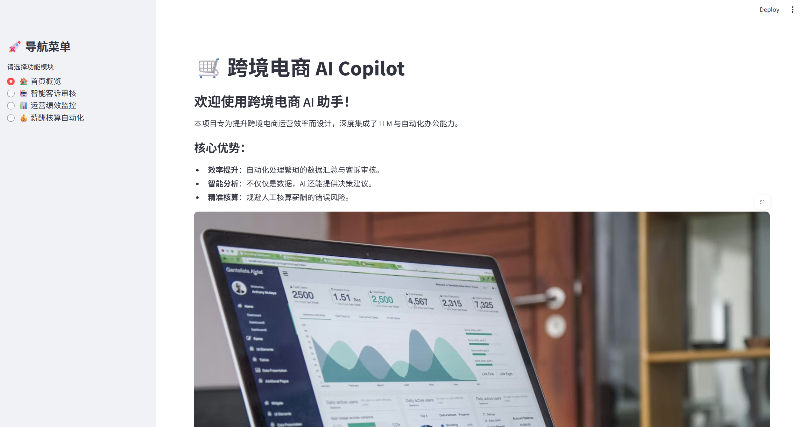
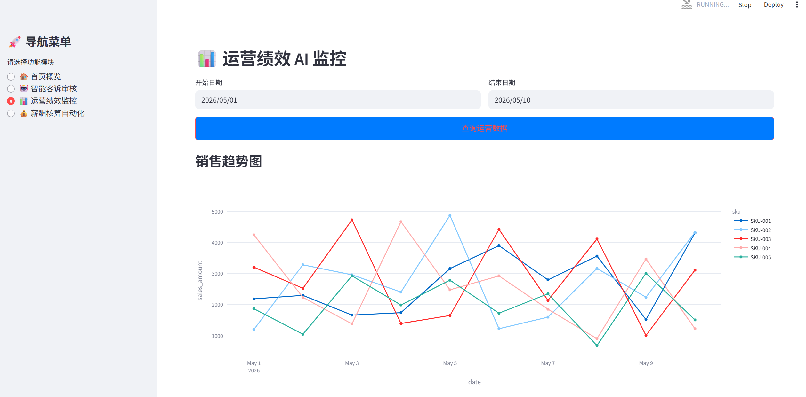
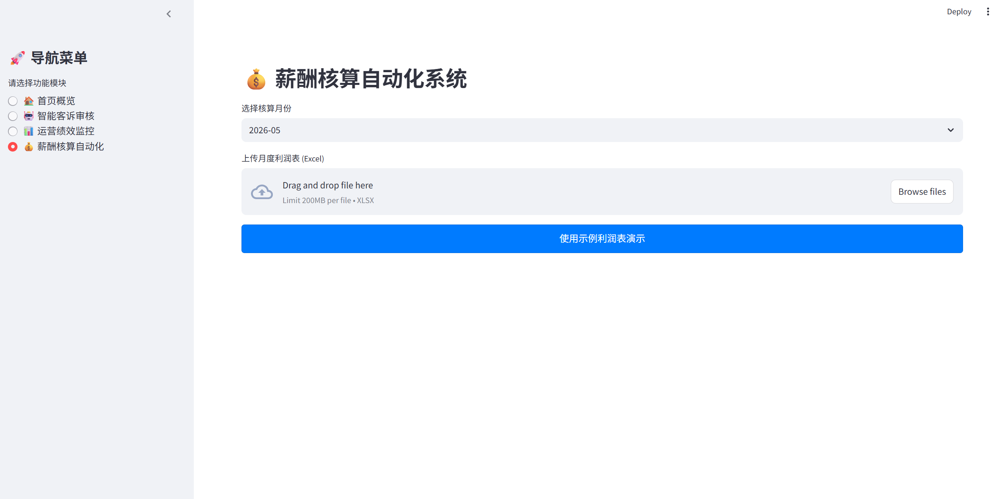

# 🛒 跨境电商 AI Copilot (E-commerce AI Assistant)

本项目旨在利用大语言模型（LLM）与自动化脚本，解决跨境电商业务中**“客诉审核耗时”、“运营数据监控滞后”、“薪资核算繁琐”**三大痛点。

---

## 📸 功能预览 (Screenshots)

### 🏠 首页概览


### 🤖 智能客诉审核
AI 自动定责、情感分析及退款建议。


### 📊 运营绩效 AI 监控
自动识别异动 SKU 并生成 AI 运营报告。


### 💰 薪酬核算自动化
阶梯式提成逻辑，一键生成结算明细。


---

## 🛠️ 技术栈 (Tech Stack)

- **Language**: Python 3.10+
- **Framework**: Streamlit (UI)
- **Data**: Pandas, SQLite
- **AI**: DeepSeek API (兼容 OpenAI 格式)
- **Viz**: Plotly

---

## 🚀 快速开始

### 1. 安装依赖
```bash
pip install -r requirements.txt
```

### 2. 配置 API Key
在 `utils/llm_client.py` 中填入您的 DeepSeek API Key，或设置环境变量 `LLM_API_KEY`。

### 3. 初始化数据
```bash
python init_db.py
```

### 4. 运行应用
```bash
streamlit run app.py
```

---

## 📁 目录结构
```text
├── app.py              # Streamlit 主程序
├── init_db.py          # 模拟数据生成器
├── modules/            # 核心业务逻辑
│   ├── ticket_auditing.py
│   ├── performance_monitor.py
│   └── payroll_engine.py
├── utils/              # 工具类 (LLM Client)
├── screenshots/        # 项目截图
└── requirements.txt    # 依赖项
```
